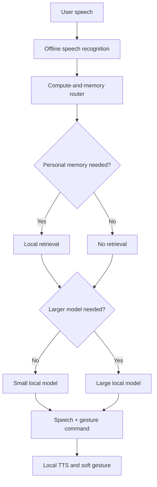

Yes—this can be a strong HRI paper. The correct primary track is still **Systems** because the contribution is the integration of offline speech, adaptive model routing, personalized memory, and physical soft gestures into one embodied interaction system. HRI explicitly places integrated hardware/software behavior in Systems; a user study is not mandatory when the system evaluation supports the claims. [HRI Systems track](https://humanrobotinteraction.org/2027/full-papers/)

## Recommended paper concept

Working title:

> **An Offline Personalized Conversational Robot with Compute-Aware Model Routing and Soft Embodied Gestures**

The central research question should be:

> Can an embodied robot provide private, personalized conversation entirely on edge hardware while dynamically selecting model size and personal-memory retrieval to reduce latency and computation?

## Proposed architecture



The router makes two separate decisions:

1. **Memory decision:** RAG or no RAG?
2. **Compute decision:** small model or larger model?

That produces four possible routes:

| Route | Example |
|---|---|
| Small model, no RAG | “Hello,” “Thank you,” simple social exchanges |
| Small model with RAG | “What kind of tea do I prefer?” |
| Large model, no RAG | Complex general reasoning or open conversation |
| Large model with RAG | “Considering what happened this week, help me plan tomorrow.” |

This is clearer than calling the method “hierarchical speculative decoding.” Use the term **cascaded model routing** or **compute-aware routing**. Speculative decoding was central to the previous work and should not be reused as the claimed novelty.

## Recommended model stack

| Component | Recommended starting point | Reason |
|---|---|---|
| Speech-to-text | Faster-Whisper `small.en`, quantized | Established offline ASR with lower memory usage; benchmark `base.en` if necessary. [Faster-Whisper](https://github.com/SYSTRAN/faster-whisper) |
| Small router/model | Qwen3-0.6B, non-thinking mode | Small, Apache-2.0 licensed, and supports structured instruction following. [Qwen3-0.6B](https://huggingface.co/Qwen/Qwen3-0.6B) |
| Larger generator | Qwen3-4B, 4-bit quantized | Stronger dialogue model; test actual memory and latency before committing. [Qwen3-4B](https://huggingface.co/Qwen/Qwen3-4B) |
| Embeddings | BGE-small-en-v1.5 | Compact local embedding model suitable for personal-memory retrieval. [Model card](https://huggingface.co/BAAI/bge-small-en-v1.5) |
| Retrieval store | SQLite + FTS5 + exact in-memory cosine search | SQLite is the source of truth; normalized BGE vectors are stored as BLOBs and searched exactly at Version 1 scale. Add a rebuildable FAISS index only if measured scale or latency requires it. |
| Text-to-speech | Piper for speed; Kokoro as quality alternative | Both operate locally; choose through latency testing. |
| Gesture controller | Separate microcontroller with predefined gesture IDs | Prevents unrestricted LLM output from directly controlling actuators. |

### Hardware choice

Use **one main platform**, not both, initially.

- **Jetson Orin Nano Super 8GB:** better research story because routing and resource efficiency genuinely matter. NVIDIA lists 8GB memory and a 7–25W power range. [Official specifications](https://www.nvidia.com/en-us/autonomous-machines/embedded-systems/jetson-orin/nano-super-developer-kit/)
- **Jetson AGX Thor:** easier deployment because it has 128GB memory, but its large compute capacity makes the “saving scarce edge resources” argument less compelling. It can serve as an upper-bound comparison if time permits. [Jetson Thor specifications](https://www.nvidia.com/en-us/autonomous-machines/embedded-systems/jetson-thor/)

If by “Jetson Nano” you mean the original 4GB Jetson Nano rather than Orin Nano, a resident 0.6B-plus-4B pipeline is unlikely to be practical. You would need a much smaller generator or sequential model loading.

## Personal memory dataset

The one-week memory should be implemented now, not listed entirely as future work. Future work can be multi-week, multi-user, and automatically learned memory.

Each memory record should contain:

```text
Timestamp
Memory text
Memory type: event / preference / routine / fact
Sensitivity level
Consent status
Source
Expiration or deletion status
```

Example week:

- Monday: user started a robotics project
- Tuesday: user prefers morning meetings
- Wednesday: user dislikes overly long answers
- Thursday: user has an appointment next Monday
- Friday: user changed tea preference
- Saturday: user completed a project milestone
- Sunday: user plans to travel

Queries should test:

- Direct facts
- Preferences
- Temporal relationships
- Updated or contradictory information
- Recent versus older events
- Questions for which no memory exists
- Requests involving sensitive or non-consented information

### Quantitative benchmark

One real person over one week is sufficient for a demonstration but not for generalizable evaluation. Use:

1. A public conversational-memory benchmark for quantitative results.
2. Your seven-day personal-memory case study for the physical demonstration.

**LoCoMo** is a relevant benchmark: its conversations average approximately 600 turns and span up to 32 sessions, with question-answering and temporal-memory evaluation. You can evaluate on a smaller, clearly documented subset for the deadline. [LoCoMo paper](https://aclanthology.org/2024.acl-long.747/)

If you use actual personal information from a person, obtain explicit consent and confirm the appropriate institutional ethics process before collecting it. Otherwise, use a fictional seven-day persona and describe it as a controlled benchmark—not human-participant data.

## Soft-robotic gestures

Use four or five safe, predefined gestures:

- Listening posture
- Gentle nod
- Acknowledgement movement
- Thinking or processing gesture
- Neutral reset

The language model should output a constrained command such as:

```json
{
  "speech": "You mentioned that you prefer meetings in the morning.",
  "gesture_id": "ACKNOWLEDGE",
  "memory_used": ["day_2_preference_03"]
}
```

The gesture controller validates the command and executes only known gesture IDs.

Be precise about terminology: if the compliance comes from pneumatic, tendon-driven, elastomeric, or other soft actuation, call it **soft robotics**. If it is a normal servo under a soft covering, call it **compliant or expressive robotic motion**.

Without a user study, you may claim that gestures were synchronized and reliably executed. You cannot claim they improved empathy, engagement, trust, or naturalness.

## Required experiments

### 1. Router evaluation

Create an independently annotated test set containing simple, complex, personal-memory, and ordinary queries.

Report:

- RAG/no-RAG decision accuracy
- Small/large model decision accuracy
- Percentage of queries handled by the small model
- Incorrect escalations and incorrect non-escalations
- Compute saved relative to always using the large model

### 2. RAG evaluation

Report:

- Recall@k
- Mean reciprocal rank
- Answer accuracy
- Temporal-question accuracy
- Updated-preference accuracy
- Correct abstention when information is absent
- Hallucination rate
- Whether answers cite the correct local memory record

### 3. Model-routing baselines

Compare:

1. Always small model, no RAG
2. Always large model, no RAG
3. Always large model with full memory/RAG
4. Your adaptive router

Measure:

- End-to-end latency
- Answer correctness
- Memory-answer accuracy
- Peak RAM/VRAM
- Power or energy per interaction
- Large-model invocation rate

### 4. Physical-system evaluation

Report:

- Speech-recognition latency
- Routing latency
- Retrieval latency
- Generation latency
- TTS latency
- Total response latency: median and 95th percentile
- Gesture-command success rate
- Gesture actuation latency
- Speech–gesture onset difference
- Reliability over repeated actuation cycles
- Verification that interaction works without network access

## Track decision

| Track | Fit |
|---|---|
| **Systems** | **Best fit.** The contribution is the complete offline personalized embodied system. |
| Technical | Appropriate only if you introduce and rigorously evaluate a genuinely new routing algorithm as the paper’s primary contribution. |
| Design | Appropriate only if the soft-robot mechanism or gesture-design process becomes the main contribution. |
| User Studies | Appropriate only if the principal contribution comes from a properly approved human study. |

Submit to:

> **Primary: Systems**  
> **Optional second choice: Technical**

## Your defensible contributions

The paper can claim four contributions:

1. An independently developed offline conversational robot combining local speech recognition, generation, retrieval, TTS, and soft embodied gestures.
2. A two-dimensional router that independently selects model size and whether personal-memory retrieval is needed.
3. A local, temporally structured personal-memory system evaluated on conversational-memory questions and a seven-day case study.
4. A physical-system evaluation covering accuracy, retrieval, latency, resource consumption, offline operation, and speech–gesture synchronization.

Voice prosody, camera-based perception, multimodal emotion estimation, multi-user memory, and long-term field deployment should remain future work. This scope is achievable and sufficiently distinct from KATZE-AURA, provided every implementation, dataset, robot design, experiment, and result is new.
