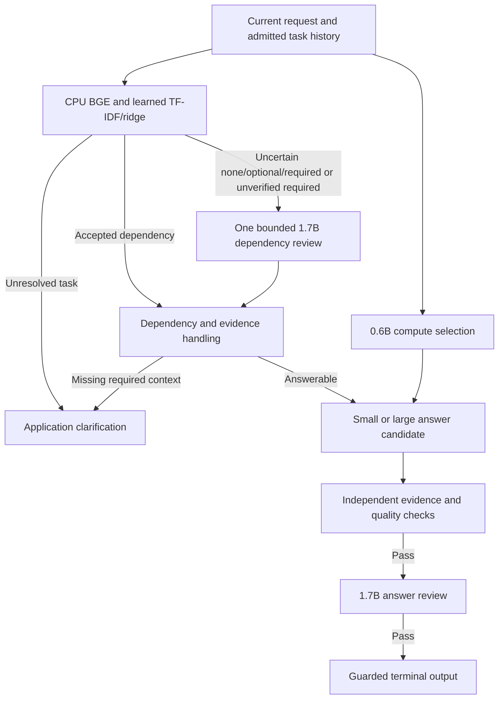

# Oline HRI

Software scaffold for an offline personalized conversational robot running on a
Jetson Orin Nano.

The research concept and system decisions remain documented in
[`README(2).md`](<README(2).md>) and [`developments.MD`](developments.MD).

## Current scope

The current milestone provides the Python 3.10 package, validated JSON
configuration, offline automated tests, microphone speech-to-text, and routed
terminal conversation through local Ollama models. The candidate
`--routing-policy reliable` adds a local, trained four-mode dependency
classifier, independent personal-evidence checks, and bounded answer review.
`chat` selects this candidate by default. The four-part repair is implemented;
finite validation and measured limitations are recorded under
[reliable routing](#candidate-reliable-routing). General factual quality and
model-switching latency remain limitations.

The historical `--routing-policy llm` path remains available for reproducibility.
It asks `qwen3:0.6b` for two independent structured decisions: input `form` plus
`memory_required`, and `model_size`. The reliable candidate replaces the memory
decision with the local dependency classifier and retains independent 0.6B
compute selection. Both large generator roles use `qwen3:1.7b`; only these two
model tags are configured for deployment. Generated responses are constrained
and validated as:

```json
{
  "speech": "You prefer jasmine tea without sugar.",
  "gesture_id": "NO_ACTION",
  "memory_used": ["mem_0123456789abcdef0123456789abcdef"]
}
```

An experimental `chat --routing-policy lightweight` mode removes the compute
classifier call and retains the active generator between text turns. It uses
local rules for compute selection and the existing memory-intent policy before
any optional memory classifier. See [lightweight routing](#experimental-lightweight-routing)
for behavior and validation limits; no speed or quality improvement is established yet.

Of the model output, only validated `speech` is printed to standard output.
Optional route and ID-only diagnostics are written to standard error.
`gesture_id` remains `NO_ACTION` until the later hardware-action milestone.
`memory_used` may contain only unique IDs from the exact verified evidence
supplied for that turn. Request-linked records are required citations; when
linked evidence exists, unrelated candidates are excluded from both the prompt
and citation allowlist. The historical `llm` path returns a fixed abstention
without a high-confidence request link. The reliable candidate instead
distinguishes optional personalization, which can fall back to general help,
from required recall, which asks for the missing detail.

Add `--show-memory-ids` to print privacy-safe, ID-only diagnostics after a
validated reply. They distinguish the ranked records returned by retrieval,
the whole records actually disclosed to the generator, and the model's
validated citations. Memory text, scores, and metadata are never printed by
this diagnostic.

Personal memories can be stored in SQLite for a rolling seven-day window,
reviewed, corrected as versioned records, and forgotten by exact ID. Storage is
either explicit with `memory remember` or `/remember`, or enabled for a chat
session with the operator-controlled `--auto-memory` option.
Expired rows and their derived indexes are removed before memory operations or
memory-backed retrieval. FTS5 provides literal keyword search. The pinned
[`BAAI/bge-small-en-v1.5`](https://huggingface.co/BAAI/bge-small-en-v1.5/tree/5c38ec7c405ec4b44b94cc5a9bb96e735b38267a)
ONNX model also creates normalized 384-dimensional embeddings on the CPU for
exact cosine-similarity search. Deterministic reciprocal-rank fusion combines
the two result lists; a bounded lexical topic-coverage pass reranks that pool
for inspection and memory-aware chat without another embedding or LLM call.

## Local commands

Run these commands from the repository root using the project virtual
environment explicitly:

```bash
PYTHONPATH=src .venv/bin/python -m oline_hri info
PYTHONPATH=src .venv/bin/python -m oline_hri config check
PYTHONPATH=src .venv/bin/python -m oline_hri config show
PYTHONPATH=src .venv/bin/python -m oline_hri chat --prompt "Hello"
PYTHONPATH=src .venv/bin/python -m oline_hri chat
PYTHONPATH=src .venv/bin/python -m oline_hri chat --show-route --show-memory-ids
PYTHONPATH=src .venv/bin/python -m oline_hri chat --routing-policy reliable --show-route
PYTHONPATH=src .venv/bin/python -m oline_hri chat --routing-policy reliable --voice --show-route
PYTHONPATH=src .venv/bin/python -m oline_hri chat --voice --auto-memory --show-route --show-memory-ids
PYTHONPATH=src .venv/bin/python -m oline_hri speech check
PYTHONPATH=src .venv/bin/python -m oline_hri speech listen --show-metrics
PYTHONPATH=src .venv/bin/python -m oline_hri chat --voice
PYTHONPATH=src .venv/bin/python -m oline_hri memory remember --kind preference
PYTHONPATH=src .venv/bin/python -m oline_hri memory list
PYTHONPATH=src .venv/bin/python -m oline_hri memory search
PYTHONPATH=src .venv/bin/python -m oline_hri memory semantic-search
PYTHONPATH=src .venv/bin/python -m oline_hri memory hybrid-search
PYTHONPATH=src .venv/bin/python -m oline_hri memory rebuild-index
PYTHONPATH=src .venv/bin/python -m oline_hri memory rebuild-embeddings
PYTHONPATH=src .venv/bin/python -m oline_hri memory embedding-status
PYTHONPATH=src .venv/bin/python -m oline_hri memory prune
PYTHONPATH=src .venv/bin/python -m oline_hri memory correct MEMORY_ID
PYTHONPATH=src .venv/bin/python -m oline_hri memory forget MEMORY_ID
PYTHONPATH=src .venv/bin/python -m oline_hri.evaluation validate
PYTHONPATH=src .venv/bin/python -m oline_hri.evaluation prompts --track all
PYTHONPATH=src:scripts .venv/bin/python -m unittest discover -s tests -v
```

## Offline microphone speech-to-text

Install the pinned native runtime and local English models once:

```bash
scripts/setup_stt.sh
```

The installer verifies every downloaded source, builds stable `whisper.cpp`
v1.9.2 with CUDA, locally quantizes `small.en` and `base.en` to Q5_0, and
installs the verified Silero VAD v6.2.1 ONNX model under
`~/.local/share/oline-hri/stt`. It refuses to overwrite an inconsistent
existing installation. The downloaded projects and model weights are
MIT-licensed; consult their installed/upstream license notices before
redistributing them.

The speech feature introduced the required `speech` section in schema 5;
schema 6 added `ollama.general_large_model`. Current schema 7 also requires
`memory.retention_days`. Older custom files are rejected deliberately. To
migrate a schema-6 file, add `"retention_days": 7` to its `memory` object and
set `schema_version` to `7`, or start from the current default.

The default capture device is the Maono microphone's stable ALSA selector,
`plughw:CARD=Microphone,DEV=0`. `speech check` validates the pinned manifest and
checksums, opens the Silero model with CPU ONNX Runtime, and probes the verified
Whisper executable without opening the microphone. `speech listen` records one endpointed
utterance and prints only its accepted transcript; `chat --voice` repeatedly
feeds accepted transcripts through the existing router, retrieval, response,
and memory-safety boundaries. Press Ctrl+C to leave voice chat.

If `speech listen` reports `no usable speech detected`, speak close to the
dynamic microphone and check its physical mute and gain controls. ALSA can
still report the USB device and capture switches as active when the acoustic
signal is too quiet to cross the VAD threshold.

Capture is converted to 16 kHz mono PCM in 512-sample frames. CPU Silero VAD
uses 300 ms of pre-roll, a short start trigger, and one second of ending
silence. A completed utterance is written to a private temporary WAV, passed to
a short-lived CUDA `whisper-cli` process, and deleted before the transcript is
routed. The primary `small.en Q5_0` model falls back to `base.en Q5_0` only for
a runtime/backend failure. Silence, noise markers, out-of-bounds text, and low
mean token-probability results are rejected; that probability is a heuristic,
not a calibrated confidence score, and must be tuned using device-level tests.

Voice mode unloads configured Qwen models before each capture. Whisper exits
before the accepted text reaches Qwen, preserving the one-heavy-model-at-a-time
boundary on the 8 GB Jetson. The current output remains terminal text; TTS and
speaker half-duplex control are separate milestones. Raw audio is not retained
by default.

To validate another configuration file, put `--config` before the command:

```bash
PYTHONPATH=src .venv/bin/python -m oline_hri --config path/to/config.json config check
```

## Seven-day memory and recall

The default `memory.retention_days` is `7`, meaning a rolling 168-hour window
from the instant a memory is saved. The deadline is UTC and exclusive: at the
exact `retention_until` timestamp, the record is no longer available. A manual
`--retention-until` may make a record expire sooner, but cannot extend it past
the configured window. Correcting a memory preserves its original deadline, so
corrections cannot restart the retention clock.

Save a confirmed fact, inspect its deadline, and talk from it with:

```bash
PYTHONPATH=src .venv/bin/python -m oline_hri memory remember --kind preference
PYTHONPATH=src .venv/bin/python -m oline_hri memory list
PYTHONPATH=src .venv/bin/python -m oline_hri chat --show-route --show-memory-ids --prompt "What kind of tea do I prefer?"
PYTHONPATH=src .venv/bin/python -m oline_hri memory prune
```

At the private `memory text>` prompt, enter the answer as a statement—for
example, `The user prefers jasmine tea without sugar.` Do not enter the future
question (`What tea do I prefer?`); question-shaped text is rejected because it
is not evidence the assistant can answer from.

You can also save and test memories without leaving the main interactive text
chat:

```text
/remember preference I prefer jasmine tea without sugar.
/remember routine I usually drink tea in the morning.
/memories
What kind of tea do I prefer?
```

The syntax is `/remember KIND TEXT`, where `KIND` is `event`, `fact`,
`preference`, `relationship`, or `routine`. Each command is explicit consent to
store that one statement for the configured seven-day window. Ordinary chat
lines are not stored unless automatic memory was enabled for the session.
`/memories` reviews active records; `/clear` clears only conversation history,
while `/exit` leaves the stored memories available to later chat sessions.

For natural conversation from speech-to-text, the operator can enable automatic
memory once when starting the session:

```bash
PYTHONPATH=src .venv/bin/python -m oline_hri chat --voice --auto-memory --show-route --show-memory-ids
```

The person can then speak normally—for example, `I prefer jasmine tea without
sugar.` No spoken “remember this” phrase is required. The local `qwen3:0.6b`
model classifies only whether an eligible personal statement should be saved
and which memory kind it has. The application stores the exact accepted
speech-to-text transcript, never a model-written claim. A deterministic gate
first skips questions, non-personal lines, and obvious secrets or sensitive
health statements; the classifier also skips greetings, temporary feelings,
hypotheticals, jokes, and uncertain statements. Exact duplicates are ignored.
Only plausible candidates incur the extra local classification call, and it
runs after the reply is printed or a recoverable reply error is reported.
An accepted statement can therefore still be stored when response generation
fails. New records print `memory> automatically remembered ...`; repeated
statements print `memory> already remembered ...` with the existing ID and
deadline. Repetition does not extend retention.

For a text-only dry run, omit `--voice` from the command above and enter:

```text
I prefer jasmine tea without sugar.
My robotics meetings are Tuesday mornings.
Theo is my robotics project partner.
/memories
/clear
What kind of tea do I prefer?
When are my robotics meetings?
Who is Theo to me?
```

The first three lines supply facts and should take `memory_required=false`;
automatic storage is a separate decision. After `/clear`, the three recall
questions should take `memory_required=true` and show the saved IDs. Clearing
session history tests database recall; restarting chat also preserves those
records until their deadlines. After updating application code, exit and
restart any already-running chat process to load the changes.

In the historical `--routing-policy llm` path, personal statements receive a
brief acknowledgment. If the small model echoes
one as a robot-owned preference or possession (for example, `I prefer...`), the
application uses `Thanks for telling me.` and excludes that bad echo from
history. Standalone recall questions use fresh retrieved evidence without
unrelated earlier replies; explicit follow-ups can still use session context.
The reliable candidate additionally checks acknowledgment quality and excludes
detected personal values from reusable history regardless of the predicted route;
ordinary general discussion and recognized draft edits can retain context.

`remember` prints the exact retention deadline. Cleanup happens automatically
before every memory command and whenever chat actually takes a memory route;
`memory prune` is available for an explicit cleanup and count. It also removes
legacy records more than seven days old even if they were created before this
policy added deadlines. Cleanup is profile-scoped and hard-deletes the
authoritative row; SQLite triggers remove its FTS and embedding copies.

Automatic capture is off by default. Enabling `--auto-memory` is a session-level
operator opt-in and must be done only after the people using the robot have
agreed to seven-day transcript storage. Even then, the application saves only
eligible user statements—not assistant replies or inferred facts. Without the
flag, only text explicitly supplied through `memory remember` or `/remember` is
stored. Use fictional data on an unencrypted development device.

Memory text is requested interactively so it does not have to appear in shell
history. `--text` is available for fictional test data and automation. The
default plaintext database is `~/.local/share/oline-hri/memory.sqlite3`, with
private directory/file permissions and SQLite secure deletion enabled. This is
not guaranteed erasure from flash media or backups, and SQLite is not encrypted;
do not store real sensitive information until the device and backup storage are
encrypted.

The current development unit was observed using `/dev/mmcblk0` storage with no
visible dm-crypt/LUKS layer, rather than the planned encrypted NVMe baseline.
Use fictional memory data on this unit until that deployment prerequisite is
met.

`memory.profile_id` is a logical data partition, not authentication. Anyone
with access to the local account or database file may read its contents. Do not
store passwords, PINs, payment details, security codes, or unconfirmed model
inferences in ordinary personal memory.

The FTS5 index contains a derived copy of searchable memory text and must be
protected like the authoritative database. Keyword queries are treated as
literal terms joined with `AND` and do not perform synonym matching. Hybrid
search uses lexical and semantic rank positions rather than adding their
incomparable raw scores. Semantic queries accept up to 1,000 characters, while
the stricter lexical leg remains capped at 200 characters and 16 unique terms;
a lexical validation failure degrades to semantic-only retrieval. The Jetson's
SQLite version cannot guarantee forensic erasure of deleted FTS segments,
reinforcing the encrypted-storage requirement.

Ollama is restricted to a loopback URL (`localhost`, `127.0.0.0/8`, or `::1`).
Configuration validation rejects remote hosts, credentials, URL paths, queries,
and fragments. The default HTTP client also disables environment proxies, and
generation failures are sanitized before reaching the CLI, so retrieved
personal records cannot be redirected or echoed through routine error output.
Interactive chat reports a failed turn with one fixed message and remains open;
a failed `chat --prompt` request exits with status `3`.

## Candidate reliable routing

The [14 September repair record](evaluation/routing_reliability_20260914/README.md)
documents the candidate, validation failures and subsequent focused repairs. It addresses the difference
between mentioning a personal situation and needing an unstated personal fact.
General support can use what the person has just said without recalling a
stored memory.

`DependencyClassifier` combines the pinned CPU BGE embedding with learned
word/character TF-IDF features and a regularized ridge classifier. It predicts
four request dependencies from the current text and admitted task history:

| Mode | Response behavior |
| --- | --- |
| `none` | Answer from the current request and general knowledge; skip personal retrieval. |
| `optional` | Use relevant authorized context when available; otherwise give a useful general answer. |
| `required` | Retrieve the unstated personal fact needed to answer; ask for the missing detail if unavailable. |
| `clarify` | Ask a short question when the intended task or referent is unresolved. |

Vocabulary, IDF, and classifier weights are fitted on training examples.
Separate development groups fit empirical thresholds on the gap between the
two highest scores. An observed-support floor prevents extending acceptance
below the smallest accepted calibration margin for each class. This leaves
the fitted weights and accepted calibration rows unchanged. A rejected margin
or disabled class marks uncertainty.
These margins are not probabilities, and calibration on authored examples is
not a guarantee for new conversation. The first release clarified on rejected
margins and withheld too many general answers. The revised candidate adds one
bounded larger-model check of whether an uncertain `none`, `optional`, or
`required` prediction needs an unstated personal value. A raw `clarify`
prediction directly asks a short question: a Boolean personal-facts verdict
cannot establish that the task or referent is clear. Accepted required
predictions with recognizable recall intent remain in place. Without that
signal, an accepted required prediction gets one bounded review; disagreement
asks for clarification instead of assuming missing memory or downgrading to
an unrestricted general answer. Direct personal-value questions and explicit
stored-input requests need no special word such as “remember”. Bare “I”, “me”
or “my” is insufficient to establish recall. A
separate `qwen3:0.6b` call selects generator
size; an invalid size result conservatively selects large without changing
the dependency. Classifier scores and artifact provenance remain local
metadata, with no fabricated dependency-model generation.



Routing does not authorize facts. Current assertions and freshly authorized,
request-linked records are the only personal sources. Question premises and
old assistant replies are not evidence. Detected personal disclosures and answers
are withheld from future model history even after a wrong general route. History
admission keeps bounded general tasks and explicit draft artifacts, including
recognized fictional first-person edits; it can conservatively drop useful
context.

Mixed recall plus independent general help can preserve both parts. A bounded
verified renderer supplies a personal prefix from current records, while the
generator receives only the standalone general subrequest. Missing personal
evidence produces a question plus the independently answerable general part.
The combined answer is reviewed, and cited snapshots are checked again after
review and inside a short database transaction for final output. Corrections
or deletion cannot interleave with that guarded write. Clock expiry is checked
when the lock is acquired; time itself continues during the brief write.

Deterministic checks detect bounded repetition, promise-only replies, copied
unrelated answers, unsupported physical-action claims, and unsupported
personal claims. The existing 1.7B model
independently reviews usefulness, personal evidence, and configured robot
identity/capabilities. A rejected small answer can receive one 1.7B retry;
there are at most two generation attempts in total. Unusable optional evidence
can be discarded within that same budget. Exhaustion returns an application
clarification. The reliable path does not use the historical large-to-small
timeout fallback described below.

Detailed deployment context is supplied to generation only for relevant
assistant/specification/tool questions. The independent reviewer always
receives the complete deployment facts. A separate bounded check rejects
unsolicited instructions involving configured internal tools; ordinary uses
of words such as “whisper” are not intended as tool references.

`--show-route` adds an `answer>` diagnostic with effective mode, retrieval
outcome, actual generator or `application`, and answer/review attempt counts.
Raw candidates, review outputs, original classifier metadata, and any
application-added memory citations remain distinct in the reply record.
Both typed and voice chat use the same guarded writer. The client retains the
active model between text calls, unloads peers before switching, and unloads
on exit; voice mode also unloads before speech recognition.

When context is missing, the application asks one short question without an
“I don't have that memory” preamble. Safe general requests and their
clarification questions can become context for the next turn through the
existing history checks. Required recall and detected private content remain
outside general task history.

The finite lexical checks and model review do not prove that all future
invented facts or poor answers will be caught. Paraphrases, ambiguous entities,
unrecognized disclosures, and reviewer errors remain limitations. The conversation-opening
full suite ran 1,351 tests with 26 skipped and passed before its final wording
and retry refinements; all 174 final focused tests also pass. The second frozen 32-case
release passed only 20 complete routing-and-delivery criteria; its failures
remain recorded. Subsequent targeted repairs correct observed nonanswers,
comparison context and incomplete-speech handling, while a recommended audio
title remains unverified. The later focused quality check passed only 3/8
complete outcomes, despite eight correct routes; that quality failure remains
recorded. See the repair record for the separate targeted checks and measured
latency. The final deployment-context repair passed its four narrow live
controls; a literal-word mismatch and thin specification wording remain.
The [V4 source and validation snapshot](evaluation/routing_reliability_20260914/candidate_snapshot_v4/snapshot.json)
preserves that earlier suite, packaging check and targeted text replay. The
[later conversation-opening checks](tmp/conversation_opening_20260915/validation.json)
record that context-first follow-up and its test suite.
That follow-up exposed a model-quality failure: the desk-tidying request
routed generally, but both bounded attempts were withheld and the final reply
asked for detail. Generic practical-task retry guidance did not resolve it.
The subsequent practical-answer repair uses a closed instruction format from
the first attempt for explicit practical-help requests with recognized exact
minute budgets and without linked memory. These plans use the configured
general-large model directly (`practical_guidance_large`), because the small
model produced incoherent steps that passed model review. The raw compute
decision remains recorded separately from the actual generator. The application adds an instruction
to set a timer for the supplied budget and stop when it rings; the model supplies
the task steps. Untimed practical requests use this format on
the existing small-to-large retry. Both rendered text and unnumbered instructions
pass the existing evidence and quality checks, followed by model review. Raw
model output is retained separately from the `human_guidance_steps` rendering.
This format excludes drafts and required recall; it does not add another attempt
after an initial large-model failure. See [the practical-answer results](results.md#2026-09-15-practical-answer-quality-repair)
for the separate development failures and validation runs.
The latest practical-answer check passes the desk and paper tasks (2/3); the
laundry reply still assumes an unsupplied location/accessory. The final suite
passed with 1,384 tests run and 26 skipped; 205 focused tests also passed.
The [validation record](tmp/practical_answers_20260915/validation.json) preserves
the final source, actual model calls and the remaining failure.
A new microphone speech-to-text sample has
not been recorded for this repair.

## Historical LLM routing and shared hybrid retrieval

The [2026-09-12 shared-memory improvements](evaluation/memory_pipeline_20260912/README.md)
add explicit subject/attribute matching, coverage of multiple requested fields,
and recognition of personal inputs in later clauses. Unlinked neighbors are
never supplied to generation. Conflicting values for the same event are kept;
bounded partial recall can state supported facts and missing fields separately.
Bounded event ordering/interval calculations use consistent stored timestamps
and retain literal-answer, citation, and freshness checks. These shared evidence
checks are reused by the reliable wrapper as well as earlier routing modes
and fixed-generator controls. The linked report describes earlier validation;
new model quality and performance measurements remain pending.

With the historical `--routing-policy llm`, each chat turn follows this sequence:

```text
user text
  |-> qwen3:0.6b memory classifier -> no: skip retrieval
  |                                  `-> yes: FTS5 + BGE -> RRF candidates
  |                                           `-> request-link analysis
  |                                               + required-first packing
  `-> qwen3:0.6b size classifier   -> small or large generator

selected evidence + compute result -> selected generator
```

The two decisions produce this exact matrix:

| Personal memory | Compute route | Retrieval | Generator |
| --- | --- | --- | --- |
| No | Small | Skipped | `qwen3:0.6b` |
| Yes | Small | FTS5 + BGE + RRF | `qwen3:0.6b` |
| No | Large | Skipped | `qwen3:1.7b` |
| Yes | Large | FTS5 + BGE + RRF | `qwen3:1.7b` |

The memory classifier labels the input form before deciding `memory_required`
in the same response; this helps the small model distinguish a newly supplied
fact from a question asking to recall one. The independent size classifier
returns only `model_size`. Both responses are validated against their exact
schemas; malformed or truncated routing output fails closed without a
heuristic fallback. Historical evaluation records with the old Boolean-only
memory response remain readable. Routing uses greedy
decoding (`temperature=0`) with seed `42`, independently of the generator's
conversational temperature. The four small/large and memory/no-memory
combinations are tested independently. Configuration pins the resident-small
and shared-large tags and rejects a large tag that collides with the small one.

Memory need and model size are separate classifications: personal recall does
not imply a large model, and a complex general plan does not imply memory.
Self-contained emotional or social disclosures that need only acknowledgment
or general support skip memory even when they mention a person or past event.
For classification only, horizontal whitespace immediately before punctuation
is normalized so ordinary transcription spacing does not change the route; the
original request is retained for retrieval, generation, and conversation
history.
Evidence cardinality is also independent of model size. Direct recall uses the
best-supported request-linked record or tied records. Explicit multi-fact or
synthesis wording may disclose the bounded candidate set, with linked records
first; incidental commas and semicolons alone do not expand that set. A simple
multi-fact recall can therefore use several required records with the small
generator.
Self-contained requests are classified without unrelated session history;
bounded prior turns are included only when the current request explicitly
refers back to them. This prevents a greeting from turning a later general
architecture question into a memory request.

For an interactive cascade test, add `--show-route`. After the resident 0.6B
classifier returns a validated decision and before retrieval or answer
generation begins, the CLI writes a diagnostic such as this to standard error:

```text
route> model_size=large selected_generator=qwen3:1.7b memory_required=false
```

The diagnostic deliberately omits the prompt and retrieved memory text. Normal
chat output is unchanged when the flag is absent.

After a successful turn, `--show-memory-ids` writes a second diagnostic to
standard error:

```text
memory> {"retrieved_ids":["mem_000000000000000000000000000000a1"],"supplied_ids":["mem_000000000000000000000000000000a1"],"model_used_ids":["mem_000000000000000000000000000000a1"]}
```

`retrieved_ids` shows the topic-reranked candidates returned by retrieval,
`supplied_ids` shows the budget-fitting whole records actually disclosed to the
generator in required-first order, and `model_used_ids` shows the exact
validated request-linked citations. Thus an optional supplied ID can be absent
from `model_used_ids`; it is not authorized as answer grounding. Fields are
emitted in fixed order, and each list preserves its pipeline order. The values
are opaque but can still be correlated with local records, so diagnostic logs
should be protected like other local application metadata.

### Serialized model lifecycle

The CLI shares one `OllamaClient` between the router and all generators. That
client holds one lock across each complete peer-unload and chat transaction, so
two application conversations cannot switch or generate concurrently through
the shared client.

The historical `--routing-policy llm` policy uses this lifecycle:

| Requested model | Before generation | Ollama `keep_alive` | State after success |
| --- | --- | ---: | --- |
| `qwen3:0.6b` | Unload 1.7B when startup state is unknown; unload it if known resident | `-1` | 0.6B remains resident |
| `qwen3:1.7b` | Unload 0.6B when startup state is unknown; unload it if known resident | `0` | 1.7B unloads immediately |

Consecutive router-to-small-generator calls reuse the resident 0.6B model
without redundant unloading. After a large route, the next router request
reloads 0.6B; it is not synchronously preloaded after the answer. Failed or
interrupted operations make the cached residency unknown, forcing a
conservative unload of every other configured model on the next call. Unload
requests contain only the model name and lifecycle fields—never prompts,
history, or retrieved memory.

This guarantee covers calls using the one shared application client. A separate
Ollama frontend, direct API caller, or another `OllamaClient` can bypass its
lock, so do not run competing model clients on the deployment service.

### Experimental lightweight routing

Select this mode explicitly for a text session:

```bash
PYTHONPATH=src .venv/bin/python -m oline_hri chat --routing-policy lightweight --show-route
```

The untrained `lightweight_v1` policy recognizes bounded greetings, direct
facts, and simple recall as small-model candidates. Explicit reasoning,
constraints, and unrecognized or context-dependent requests select large.
When large is already resident, the first consecutive easy request keeps it;
the second selects small. A complex request or lost residency resets that
streak. This rule is a starting heuristic, not a measured break-even threshold.

Memory remains an independent decision. Existing explicit privacy, personal,
and general intent rules run first. An ambiguous memory decision makes one
structured classifier call on the cached resident model, or the intended
generator when residency is unknown. Compute routing never calls an LLM.
Route metadata records `None` for skipped generations and reports the actual
decision sources with `--show-route`.

Both generators use `keep_alive=-1` in this mode. The same client lock and peer
eviction maintain sequential model use. Its `resident_model` property is a
cached hint; it cannot detect external Ollama clients. Verified composed
answers keep a selected, already resident large model with the same literal
answer and citation checks. The text session unloads on exit, including errors
and interruption; failed cleanup is reported and makes an otherwise successful
exit nonzero. Abrupt process termination cannot guarantee cleanup.

`--auto-memory` still classifies eligible disclosures on 0.6B after the answer,
which can evict a retained large model. Voice chat still unloads before every
speech-recognition stage. Cross-turn text residency gains therefore cannot be
assumed for these paths. Retrieval, memory freshness checks, answer validation,
and the timeout fallback retain their existing behavior.

The [implementation and diagnostic record](evaluation/lightweight_routing_20260912/README.md)
documents offline tests and blocked hardware preflights. The existing benchmark
runners still select their original routers. Measuring this mode requires a
new source freeze and comparison; prior result tables describe the prior code.

### Historical LLM timeout and fallback policy

Configuration schema 6 introduced separate local Ollama socket timeouts by workload:
unload requests use 30 seconds, router and small-model requests use 60 seconds,
and large-model requests use 120 seconds. These are failure budgets, not latency
targets.

For `--routing-policy llm` and the earlier lightweight runtime, only one
failure class has a generation fallback: if a routed `qwen3:1.7b`
request times out, the application makes exactly one `qwen3:0.6b` attempt with
the same prompt, history, response schema, and memory-ID allowlist. The reply
records the timed-out model in `fallback_from_model` while its generation
metadata identifies the small model. A router timeout, selected-small timeout, retrieval/freshness
failure, HTTP or protocol error, truncation, wrong model metadata, malformed
JSON, or response-contract violation never triggers a fallback. A failed
fallback aborts the turn without adding partial output to history.

For a memory-grounded fallback, the same authoritative memory snapshot is
checked before the large attempt, again before disclosing it to the fallback,
and once more after generation. Ollama HTTP bodies are read with a 64 KiB cap;
route JSON is capped at 512 characters and robot-response JSON at 16,384
characters before parsing. Transport, router, retrieval, and freshness errors
cross public boundaries only as fixed application-authored messages. The
reliable wrapper uses its separate bounded retry policy described above.

### Shared retrieval and evidence checks

Hybrid retrieval takes at most 20 candidates from each index, deduplicates by
authoritative memory ID, and uses equal-weight reciprocal-rank fusion with
`k=60`. Exact lexical results win an otherwise exact fusion tie so names and
dates are not displaced in the initial ranking. A lexical topic-coverage pass
then reranks the bounded pool, favoring distinct requested topics in synthesis
questions. Original RRF scores and source positions remain diagnostic values,
not the final ordering key. Retrieval returns at most three ranked records to the
conversation layer. A deterministic request-link heuristic uses lexical stems,
explicit names and labels, preference cues, and temporal cues to identify
high-confidence required evidence independently of the small/large route. A
direct recall keeps the best-supported linked record (preserving tied records
so detectable conflicts are not hidden). Explicit multi-fact, multi-question,
"all," or synthesis wording keeps all linked records required. Explicit
"when ... with when ..." comparisons select each event's evidence separately.
The words "plant" and "planetary" no longer trigger planning, and a direct
preference choice is not treated as a multi-memory plan. Bounded object/attribute
questions require the requested object and attribute; a neighboring lab fact
cannot answer a notebook question, and a red backpack cannot supply a bike's
missing color.
Bounded direct relationship questions recognize a matching person's name
case-insensitively, including the common `knwo` transposition, but only when a
retrieved record explicitly binds that exact person to the human user.

Answerable prompts contain only linked whole records, excluding optional
neighbors and their citation IDs. If all required records cannot fit, the turn
fails before generation. All required IDs must be cited. When no candidate has a high-confidence request
link, the historical `--routing-policy llm` application discards generated prose
and returns exactly `I do not have a verified personal memory that answers that.`
This conservative rule also
covers an unlinked answer with empty or optional-only citations. Any empty
`memory_used` is first replaced with the fixed abstention; if linked evidence
exists, the subsequent required-citation gate rejects that response. Incomplete
linked citations likewise fail validation rather than silently accepting the
answer. The reliable wrapper handles absent evidence before entering this
memory generator: optional personalization falls back to general answering,
and required recall asks for the missing information.

This request-link analysis is deliberately best-effort, not a calibrated
semantic-relevance test. In particular, a genuinely relevant candidate found
only through semantic similarity can lack the lexical or temporal anchors
needed to become required, causing a conservative abstention. No raw
BM25/cosine addition or uncalibrated cosine threshold is used.

Retrieved records and the current request are placed in one bounded,
application-created user-role JSON envelope. Memory text is explicitly treated
as factual data rather than an instruction and can never authorize an action.
The model-facing copy rewrites bare `User` and `User's`, as well as `the user`
and `the user's`, to second person (`you`/`your`) and adjusts supported verb
agreement, without changing stored memory. Instructions require human-user
facts to use `you`/`your`, never literal `the user` or robot `I`/`my`; the
validator rejects common violations. Direct-recall and transformation or
planning requests have distinct instructions, so a one-record planning request
is not reduced to verbatim recall. Audit timestamps and record-kind metadata
are not disclosed to generation; an explicit event time is included only when
the record actually has one. Times, dates, names, and relationships may come
from either the current request or cited memory, but not from elsewhere.
Neither the envelope nor any memory-requested answer is kept in reusable model
history—even when retrieval found no record—so unsupported or stale personal
claims cannot become session facts. A later personal follow-up must retrieve
current records again. Non-memory history is capped at the newest three complete
turns and 2,000 characters, and the memory envelope is capped at 3,000
characters. An aggregate
conservative prompt estimate also reserves the configured output tokens plus a
safety margin within `num_ctx`; overflow drops only complete oldest history
turns or whole lowest-ranked records, and an input that still cannot fit is
rejected before generation. Chat turns are serialized within a conversation.
The deployed model pair uses temperature `0`, a 2,048-token context,
a 192-token output cap, and a 120-second large-request failure budget. Its
conservative prompt estimate continues to reserve required evidence before
optional history or retrieval candidates. These settings supersede the
temperature `0.2`, context/output `2176/320`, and 600-second failure budget used
by the earlier v3.1 comparison. That experiment remains preserved as historical
evidence in the
[v3.1 response-quality report](evaluation/response_quality_temperature_ab_v3_1_report_20260908.md).
The current pair selection and device measurements are in the
[2026-09-09 model-pair report](evaluation/model_pair_runs/20260909_report.md).
That original comparison used 128 output tokens; the subsequent remediation
raises the cap to 192 and aligns all speech instructions at 80 words. The
context size and one-resident-model lifecycle are unchanged. Repeated memory
formatting instructions were shortened so the three-record recency and live
timeline envelopes still fit. Raising output to 256 at the same context size
would leave insufficient room for the live timeline envelope.

The [first remediation report](evaluation/model_pair_runs/20260909_remediation_report.md)
records the 22/30 structured-answer and 3/7 known-fact restart baseline.
The [2026-09-10 memory-evidence retest](evaluation/model_pair_runs/20260910_memory_evidence_report.md)
improves those to 25/30 and 7/7, with 100% retrieval coverage at three records
on the original fixture. Additional wording checks passed 9/12. The pair stayed
within the guarded Jetson limits; unrestricted personalized answering remains
unreliable.

The [previous reliability retest](evaluation/model_pair_runs/20260910_reliability_report.md)
reaches 26/30 validated responses, 12/12 on the earlier wording fixture and
12/12 on a new fictional fixture. Restart recall remains 7/7 known facts plus
2/2 safe abstentions, with seven unchanged records. Direct preference decoding
preserves the complete source fact; required citations are constrained during
generation; recognized conflicting labels trigger an audited clarification.
Unknown attributes, unauthorized citations, and stale records remain guarded.
These are application-level gains, not proof of unrestricted model accuracy.
Complex synthesis remains unreliable, and the full run was slower than the
earlier retest. The model pair and Jetson memory/context limits are unchanged.

The [bounded-composition retest](evaluation/model_pair_runs/20260910_composition_report.md)
reaches 30/30 validated adaptive answers, all 18 required citations, 12/12
paraphrase checks, and 7/7 known-fact restart recall plus 2/2 abstentions.
Complete, supported partner/timeline/milestone facts and short preparation
templates can now constrain speech before decoding. Named owners remain
explicit, all citation/freshness checks still run, and ambiguous or unsupported
requests retain ordinary guarded generation. `answer_constraint` records the
builder; `generation_policy=verified_constraint_small` records decoding a
fully specified composition on 0.6B instead of the router-selected large model.
Four such answers took 4.4–5.5 seconds each. The full run's p95 did not improve.
The unblinded audit counts 22 complete, five partial, and three incorrect
answers—not 30 correct answers. General reasoning and planning depth remain
limited. The controlled temperature-comparison runner disables these new
compositions to retain sampled prose in its experimental arms.

The [latest reasoning/planning retest](evaluation/model_pair_runs/20260910_reasoning_report.md)
improves the unblinded final-case review to 26/30 complete answers, with two
partial and two incorrect. Small offline technical notes (`reference_ids`,
not personal citations) support selected concepts. Recognized software testing,
release, and recovery requests can use bounded application-authored plans with
checks and stop/rollback conditions, decoded on 0.6B with explicit provenance.
These are not unrestricted model reasoning. Unsupported constraints retain
ordinary guarded generation. Presentation/travel plans also have more concrete
checks while preserving all memory facts.

The final rerun stopped after 27 cases on a malformed-telemetry notification;
the model unloaded. After a healthy monitoring probe, the remaining three
cases passed separately, as did 12 memory questions and five compositions.
All 30 cases therefore have validated final-source answers, but **not in one
uninterrupted final benchmark**. The telemetry root cause remains unresolved;
no safety guard was weakened. Models, context and the 192-token cap are unchanged.

Routing now combines the two small-model classifications with explicit intent
rules. Clear general definitions and procedural questions can disable memory;
personal recall and multi-fact personal requests can enable it. Explicit
comparisons and multi-step synthesis can select the large model. Retained
session history continues through the history-aware memory classifier. Raw
classifier generations are preserved alongside the final decision and its
policy source; evaluation reports distinguish these hybrid decisions from
the classifier's unmodified output. The rules are bounded heuristics and do
not guarantee correct routing for every paraphrase.

If a generated, correctly cited answer is a verbatim copy of a single
first-person human disclosure, the application can change its perspective to
you/your before running every grounding validator. It does not repair arbitrary
claims, missing citations, or unsupported facts. Raw generations are retained;
`response_transform=verified_memory_perspective` identifies this narrow change
in evaluation and restart artifacts.

An independent privacy guard prevents retrieval and supplies a fixed refusal
for recognized credential, hot-microphone third-party, and unconfirmed-affect
recall requests. This remains effective even when routing says no memory.
Normal recall still requires current, request-linked evidence and all existing
citation, conflict, relationship, and temporal checks. Named/called object
values are now valid coverage anchors, so a correct project-name answer need
not repeat an unrelated kickoff date merely to pass validation.

The database snapshot is checked immediately before disclosure and again after
generation. A corrected, forgotten, expired, cross-profile, or otherwise
changed record causes the turn to be rejected without committing it to history.
The response validator independently rejects invented, duplicate, malformed,
or non-supplied `memory_used` IDs, and forbids memory IDs in user-facing speech.
Every request-linked required record must be cited, and optional candidates
cannot be cited. Best-effort validators then check that each cited record's
distinctive literal anchors are covered and that a temporal recall includes its
stored weekday, daypart, clock, and date details. They reject common human/robot
perspective swaps; detectable negation of a positive personal relationship,
general preference, or temporal preference; unsupported personal names or
relationships; and unsupported temporal
precision from outside the current request or cited memory. A cited preference
for exactly three steps is enforced as three recognizable numbered or ordinal
steps. Detectable conflicting short-label records with shared fact anchors
require an uncertainty statement.

These checks use conservative token and regular-expression heuristics. They do
not understand every paraphrase, contradiction, relationship, or temporal
association, and they do not prove general factual completeness or semantic
correctness. Records without a safely detectable literal anchor are not rejected
merely for paraphrasing; blinded semantic review remains necessary.

Complex general, no-memory requests use a separate JSON request envelope with
an adjacent task-neutral completion rule. It tells the 1.7B generator to answer
the requested topic now, following its constraints, format, and counts, and
asks for at most 90 speech words. The generator should compare options or
recommend a choice only when the user asks for it. Plans should give concrete
actions in order and explicitly handle missing prerequisites. For recovery or
changes, it requires stopping modifications and preserving an untouched copy,
assessing damage, conditionally restoring from a verified local backup,
salvaging or rebuilding when no usable backup exists, validating before normal
use, and preventing or monitoring recurrence. The generator must not assume
resources exist or claim to have performed the actions. Offline informational
requests remain answerable.
These are generation instructions, not runtime guarantees of plan completeness
or semantic correctness.

Install all configured local models before routed chat:

```bash
ollama pull qwen3:0.6b
ollama pull qwen3:1.7b
ollama list
```

The development Jetson was verified with Ollama `0.33.3`, `qwen3:0.6b`
digest `7df6b6e09427a769808717c0a93cadc4ae99ed4eb8bf5ca557c90846becea435`
(Q4_K_M, 522 MB) and `qwen3:1.7b` list ID `8f68893c685c` (1.4 GB).
Tags can change upstream, so record and re-verify these identifiers before
collecting reproducible evaluation results. Do not pull or load `qwen3:4b` on
this Jetson; its retained benchmark is historical evidence only.

### Historical Target 2 response-speed result (superseded)

The earlier Target 2 decision selected 1.7B only for large/no-memory requests.
It passed four independent structured
quality checks. Across comparison seeds 53–55, its cold wall median was
32.697 seconds versus the reused exact-case 4B median of 75.516 seconds, a
56.7% reduction; median model load fell from 44.380 to 21.791 seconds. The 1.7B
model failed that experiment's separate grounded-memory recency gate, which led
to the then-current 4B grounded route. The 2026-09-09 model-pair decision
supersedes that deployment conclusion: both large roles now use 1.7B and the 4B
tag is unreachable. See the
[frozen protocol](evaluation/response_speed_general_model_v3_protocol.md) and
[result report](evaluation/response_speed_general_model_v3_report_20260909.md).

### Retired Qwen3-4B Jetson benchmark (unsafe historical evidence)

Do not rerun this benchmark or load `qwen3:4b` on this Jetson. The device later
recorded a `BCCPLEXWDT` reset while loading that model, so the deployed pair
excludes it. The measurements below are retained only to document the retired
experiment; see the
[superseding model-pair report](evaluation/model_pair_runs/20260909_report.md).

A controlled non-thinking benchmark of the installed `qwen3:4b` Q4_K_M model
used a 2,048-token context, a 64-token output cap, temperature `0`, and seed
`42`. The unloaded cold run took 113.99 seconds wall time, including a
72.88-second load; its generation phase produced 64 tokens at 2.45 tokens/s.
Three resident warm repeats had a median wall time of 43.89 seconds and a
median generation rate of 1.49 tokens/s.

During the historical cold run, `tegrastats` reported approximately 7.0/7.62 GB
RAM use and full 3.81/3.81 GB swap. The model completed that archived run, but
it is not a safe deployment option under the observed memory pressure. This measurement
motivated the former provisional 300-second large-request failure budget. The
v3 quality gate later showed that limit could expire just before Ollama
completed, so the superseded three-model baseline used 600 seconds; neither
value made 4B a low-latency route. The capped responses also exposed an
instruction-following limitation, so runtime success is not an answer-quality
result. See the
[archived Qwen3-4B benchmark record](benchmarks/qwen3_4b_jetson.md).

## Fictional seven-day evaluation suite

Step 15 adds the versioned
[`fictional_seven_day_v1.json`](evaluation/fictional_seven_day_v1.json)
fixture and a strict local validation, replay, and prompt-emission harness. The
case study is fully synthetic: Mira, Theo, Luma, and every event are invented.
It contains no human-participant data, is not a user study, and cannot support
claims about real users or generalizable system quality.

The preserved
[`fictional_seven_day_v1_1.json`](evaluation/fictional_seven_day_v1_1.json)
prompt-contract revision changes only suite-identifying text and the temporal
case prompt: it explicitly asks what the tea preference changed to as well as
when, without disclosing the answer. Its evidence and rubric are unchanged,
and its evaluation and packaged copies are byte-identical. V3.1 uses v1.1;
the default Step 16 CLI remains on the original v1 suite.

The fixture covers one controlled Monday-to-Sunday timeline with:

- 15 ordered memory events: 13 remembers, one correction, and one forget;
- 14 deterministic memory-record versions;
- three policy-withheld topics that contain explanations but no private values;
  and
- 30 author-gold cases spanning all four combinations of memory/no-memory and
  small/large model routing.

Cases exercise direct recall, correction, forgetting, expiration, temporal
reasoning, absence, sensitive-but-confirmed memory, prohibited storage, and
unresolved contradiction. They also compare older and newer milestones and
test that unconfirmed third-party data and affect inference remain absent.
Their annotation status is
`author_gold_pending_independent_review`; independent review is still required
before reported evaluation results use these labels.

Validate the manifest or emit stable JSON Lines from the repository root:

```bash
PYTHONPATH=src .venv/bin/python -m oline_hri.evaluation validate
PYTHONPATH=src .venv/bin/python -m oline_hri.evaluation prompts --track all
PYTHONPATH=src .venv/bin/python -m oline_hri.evaluation prompts --track router
PYTHONPATH=src .venv/bin/python -m oline_hri.evaluation prompts --track rag
```

These commands validate or emit prompts; they do not call Ollama, score model
answers, or produce latency, token, RAM, swap, thermal, power, or routing
accuracy measurements. See the
[`evaluation` documentation](evaluation/README.md) for the replay and gold-data
contract.

### Historical response-quality temperature result (superseded)

Target 1 compared generator temperatures `0.0` and `0.2` over a held-out gate
and nine blinded pairs. The gate passed and all 18 comparison attempts were
application-valid. Each arm was rubric-correct on all six memory answers and
incorrect on all three general-recovery answers. Reviewers preferred `0.0` for
the three incomplete recovery pairs, while the six memory pairs tied. Because
neither arm reached at least two of three wins in every case or six overall
wins, the preregistered result is inconclusive and the default stays `0.2`. The
[protocol](evaluation/response_quality_temperature_ab_v3_1_protocol.md),
[frozen judgments](evaluation/response_quality_temperature_ab_v3_1_20260908_blind_judgments.json),
and [final report](evaluation/response_quality_temperature_ab_v3_1_report_20260908.md)
preserve the decision trail. That was the default at the time; the later
model-pair comparison superseded it with temperature `0`.

## Historical Step 16 objective evaluation (pre-redesign)

The 2026-09-07 benchmark runner executed the real local embedding, hybrid
retrieval, routing, and answer paths. It compared 30 stateless cases across four
strategies: always-small without RAG, always-large without RAG, always-large
with bounded RAG, and the adaptive cascade. The
[frozen protocol](evaluation/step16_protocol.md) defines the settings,
denominators, measurement scope, and limitations before answer inspection.

Each run preserves raw observations, objective scores, a blinded answer-review
sheet, model/source/asset provenance, and Jetson telemetry. The offline merger
checks the four bundles' provenance and keeps the first strategy's component
retrieval pass as the predeclared source. See
[run and merge instructions](evaluation/README.md#historical-step-16-run-and-merge-pre-redesign).
Choose an owner-controlled persistent directory through `OLINE_HRI_RUN_ROOT`;
`/tmp` artifacts were lost when this Jetson rebooted during evaluation. Raw
bundles and generated dated reports can contain prompts, answers, provenance,
and device telemetry, so they are intentionally ignored and not versioned.

All four 30-case baselines completed with 120/120 valid structured turns,
zero errors, and zero fallbacks. Their provenance matched and the offline
merge completed. The adaptive run used 4B for 18/30 answers; memory and model
decisions matched the author labels on 25/30 and 19/30 cases respectively.
Its median/p95 turn latency was 82.996/126.007 s. These routing and timing
measurements do not establish answer correctness or compute savings.

These 2026-09-07 Step 16 artifacts predate the routing and grounded-generation
fixes documented above. Their aggregate historical figures are retained here,
but the private raw artifacts and generated report are local-only and must be
rerun before those metrics are attributed to the current implementation. The
separate router-only supplement remains unpooled with the adaptive run. An
unclean reboot interrupted an earlier attempt; the original trigger remains
unknown.

Collection and objective scoring are complete, but full Step 16 interpretation
remains provisional while the fixture labels await independent review and
natural-language answer quality awaits blinded human review. The current unit
runs in 15W mode on
`/dev/mmcblk0`, so storage measurements describe SD-card activity. The Maono
microphone now has a separate live STT smoke-test command, but final enclosure/noise WER
evaluation remains open. Final NVMe, speaker, actuation, and physical
offline-disconnection measurements remain deferred.

## Offline embedding model

Embedding inference uses ONNX Runtime's `CPUExecutionProvider` with two worker
threads. It does not use Ollama, PyTorch, a cloud API, CUDA, or TensorRT. Stored
memory text is embedded as-is; only search queries receive BGE's retrieval
instruction. Vectors are normalized `float32` values and searched exhaustively
in memory—there is no FAISS or separate vector service.

The runtime dependencies are pinned in `setup.cfg`. Model assets are stored
outside Git at the configured private local directory:

```text
~/.local/share/oline-hri/models/bge-small-en-v1.5/
  5c38ec7c405ec4b44b94cc5a9bb96e735b38267a/
```

Provisioning is the only step that needs internet access. From the repository
root, install the pinned dependencies and download only the three required
files from the immutable model revision:

```bash
.venv/bin/python -m pip install --editable .
.venv/bin/hf download BAAI/bge-small-en-v1.5 \
  config.json tokenizer.json onnx/model.onnx \
  --revision 5c38ec7c405ec4b44b94cc5a9bb96e735b38267a \
  --local-dir ~/.local/share/oline-hri/models/bge-small-en-v1.5/5c38ec7c405ec4b44b94cc5a9bb96e735b38267a
chmod -R go-rwx \
  ~/.local/share/oline-hri/models/bge-small-en-v1.5/5c38ec7c405ec4b44b94cc5a9bb96e735b38267a
```

The application never downloads model files at runtime. It refuses to load the
bundle unless all three SHA-256 hashes match:

| Asset | SHA-256 |
| --- | --- |
| `config.json` | `094f8e891b932f2000c92cfc663bac4c62069f5d8af5b5278c4306aef3084750` |
| `tokenizer.json` | `d241a60d5e8f04cc1b2b3e9ef7a4921b27bf526d9f6050ab90f9267a1f9e5c66` |
| `onnx/model.onnx` | `828e1496d7fabb79cfa4dcd84fa38625c0d3d21da474a00f08db0f559940cf35` |

The pinned model revision is licensed MIT. Embeddings are sensitive derived
personal data, not anonymized data, and receive the same profile, consent,
validity, retention, correction, deletion, and storage protections as their
authoritative memory records. Semantic scores are used only for relative
ranking; this milestone deliberately applies no uncalibrated score threshold.

To exercise the real local assets rather than the deterministic unit-test
embedder, run the opt-in Jetson smoke test:

```bash
OLINE_HRI_RUN_LIVE_EMBEDDING=1 PYTHONPATH=src \
  .venv/bin/python -m unittest tests.test_embedding_live -v
```

To exercise all four real Qwen routing decisions, self-contained requests after
unrelated greeting history, exact and paraphrased personal recall, large
planning paraphrases, and temporary fictional small-model RAG/non-RAG turns,
run:

```bash
OLINE_HRI_RUN_LIVE_ROUTING=1 PYTHONPATH=src \
  .venv/bin/python -m unittest tests.test_routed_chat_live -v
```

That routing suite verifies the four decisions and recall paraphrases without
requiring every large-route case to generate a full-length answer.

To run semantic answer-quality regressions, including the exact formerly
failing prompts through the real router, retriever, and generator, run:

```bash
OLINE_HRI_RUN_LIVE_QUALITY=1 PYTHONPATH=src \
  .venv/bin/python -m unittest tests.test_chat_quality_live -v
```

The quality suite creates an isolated temporary database and keeps exactly
these three fictional regression memories:

- Theo is the user's fictional robotics project partner.
- The user prefers robotics project meetings on Tuesday mornings.
- The user prefers project plans containing exactly three concise steps.

Its acceptance cases are:

- `"Hello there!"`, followed in the same conversation by `"Compare three
  offline robot architectures, reason through their tradeoffs, and create a
  detailed deployment plan."` -> `false/large`, with three distinct designs,
  tradeoffs, deployment actions, and no offline/physical-action refusal;
- `"Create a detailed contingency plan for recovering an offline application
  after database corruption without assuming network access."` ->
  `false/large`, protecting the original data, restoring only from an available
  usable backup, providing a contingency without a usable backup, and validating
  recovery before normal use resumes;
- `"Who is Theo to me?"` -> `true/small`, answering that Theo is your robotics
  project partner;
- `"What is my preferred meeting time for the robotics project?"` ->
  `true/small`, answering Tuesday mornings without invented clock or date
  precision; and
- `"Using what you remember about Theo, my robotics-project meeting schedule,
  and my preferred project-plan format, create a plan for our next meeting."`
  -> `true/large`, using/citing all three memories and producing exactly three
  concise actionable steps.

The live suites also cover the documented recall and planning paraphrases,
lowercase relationship recall, and self-contained emotional disclosures.
Architecture-design recognition and recovery-milestone checks use heuristic
wording patterns. They catch known omissions but do not establish semantic
completeness for arbitrary answers; the actual replies still need review.

It also checks second-person perspective and rejects unsupported names or
relationships. It never reads or writes the configured personal-memory
database. Full 1.7B generations unload after each call on this setup, so the
suite can take several minutes.

### Post-fix validation

The following historical verification completed on 2026-09-08 before the
task-neutral general-planning rule, database-recovery case, and stronger
architecture assertions above. These results do not validate those later
changes:

| Verification | Result |
| --- | --- |
| Full automated discovery | 420 tests, `OK` (`skipped=19`) |
| Full real-routing suite | 7 tests, `OK` in 21.163 seconds |
| Full live answer-quality suite | 9 tests, `OK` in 677.452 seconds |
| Exact end-to-end failed-prompt subset | 4/4 passed (included in the quality suite) |

The general-planning follow-up was verified separately on 2026-09-08:

- Full discovery: 424 tests, `OK` in 18.919 seconds (`skipped=20`, 404 passed).
- Focused live verification: database recovery and greeting followed by the
  architecture comparison both passed with `false/large` and empty memory
  diagnostics for the planning responses.
- The new recovery regression failed against the original architecture-specific
  rule before the change. Unskipped assertion tests also reject the earlier
  one-design comparison and snapshot-only recovery examples while accepting
  supported paraphrases.

The lowercase-relationship and social-disclosure follow-up was also verified
on 2026-09-08:

- Full discovery: 451 tests, `OK` in 19.791 seconds (`skipped=22`).
- Full real-routing suite: 9 tests, `OK` in 31.430 seconds.
- The literal lowercase/transposed request `do you knwo who rina is` used and
  cited only Rina's isolated fictional relationship record.
- The literal stress disclosure, including whitespace before its comma, routed
  `false/small`, skipped retrieval, and returned a normal supportive response.
- The same two inputs also passed consecutively in one conversation; the direct
  relationship recall excluded unrelated generation history without erasing
  that history from session state.

These focused live results cover the general-planning change, not a rerun of
the entire expanded live-quality suite. The semantic limitations above remain.

To exercise the real small -> large -> small lifecycle with short generations
and verify `/api/ps` after every transition, run:

```bash
OLINE_HRI_RUN_LIVE_LIFECYCLE=1 PYTHONPATH=src \
  .venv/bin/python -m unittest tests.test_ollama_lifecycle_live -v
```

This test performs a cold 1.7B load and can take several minutes. Its cleanup
unloads all configured models even when an assertion fails.

The lifecycle test intentionally uses short answers. The separate live-quality
suite exercises complete 1.7B architecture and database-recovery plans as well
as multi-memory planning answers. See the
[2026-09-09 model-pair report](evaluation/model_pair_runs/20260909_report.md) for
device measurements of the deployed pair.
