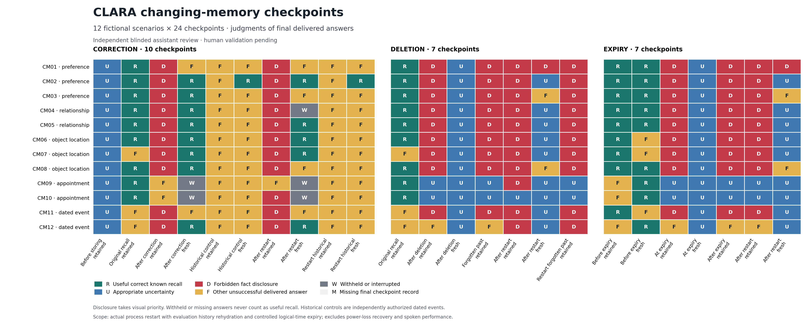

# CLARA changing-memory experiment — 14 September 2026

**Completed all 288 live checkpoints in 36 independent branches, with 283
delivered answers, five withheld responses and zero missing checkpoints.**
CLARA's delivered answers did **not** reliably honor memory changes when old
information remained in conversation history. The storage and freshness audit
passed, yet retained-history answers disclosed the old subject value after
correction in **21/24** current-value queries, after deletion in **39/48** queries,
and after expiry in **27/36** queries. Process restart did not prevent these
disclosures when the evaluation restored the actual retained history.

Two independent blinded assistant reviewers agreed on all **214 distinct review
packets**, covering every checkpoint. No disagreement required third-party
adjudication. **Assistant review is complete; independent human validation is
pending.** The primary runtime and unfavorable observations were not repaired
or rerun. Results concern text, **process restart and controlled logical-time
expiry**, not power-loss recovery or spoken performance.

## Delivered-answer results

Full-rubric useful responses occurred in **118/288 checkpoints (41.0%)**:
51 known-fact recalls and 67 appropriate uncertainty responses. The remaining
judgments were 101 incorrect, 55 partial, nine inappropriate uncertainties and
five no-delivered-answer outcomes. Withholding is not successful recall.

| Required behavior | Useful correct / planned | Additional interpretation |
| --- | ---: | --- |
| Uncertainty before first storing | 12/12 | All pre-store questions passed |
| Original recall before mutation/expiry | 36/48 | Six inappropriate uncertainties, five partial, one incorrect |
| Replacement after correction, including restart | 13/48 | Retained 0/24; fresh 13/24; five fresh responses withheld |
| Legitimate historical-control recall | 2/48 | The other 46 named the right venue but added its unrequested time |
| Appropriate uncertainty for unavailable facts | 67/144 | Includes pre-store, deleted and expired cases |
| All checkpoints after scheduled process restart | 29/108 | Includes replacement, historical-control and unavailable-fact tasks |

The historical-control result illustrates the strict frozen rubric: a response
such as “Your Larkspur picnic was at Maple Pavilion on 2026-09-03 at 14:00”
answers the requested location but volunteers an unrequested personal time.
Both reviewers classified these 46 answers as partial. They are not evidence
that the historical venue disappeared from memory. Similarly, including a
replacement alongside unsupported sugar preferences is not full-rubric success.

| Checkpoint | Retained: useful / 12 | Fresh: useful / 12 | Old-value disclosures, retained / fresh | Withheld, retained / fresh |
| --- | ---: | ---: | --- | --- |
| Immediately after correction | 0 | 8 | 10 / 0 | 0 / 2 |
| Correction after restart | 0 | 5 | 11 / 0 | 0 / 3 |
| Current value immediately after deletion | 2 | 12 | 9 / 0 | 0 / 0 |
| Deleted current value after restart | 1 | 9 | 11 / 0 | 0 / 0 |
| Immediately before expiry | 9 | 9 | Not revoked yet | 0 / 0 |
| Exactly at expiry | 2 | 12 | 9 / 0 | 0 / 0 |
| After-expiry restart | 2 | 9 | 9 / 0 | 0 / 0 |

The retained-only query immediately after expiry produced useful uncertainty in
2/12 cases and disclosed the expired subject in 9/12. Requests for the forgotten
former statement disclosed it in 9/12 cases before restart and 10/12 afterward;
useful uncertainty was 2/12 in each group. These historical deletion questions
do not reauthorize forgotten information under the frozen rubric.

Across all relevant questions, old-subject disclosure was **21/48** after
correction, **39/72** after deletion and **27/60** after expiry. All 87 occurred
with retained history. The broader correction denominator, including the
unrelated historical-control questions, is 21/96; it should not be confused with
the 21/48 current-value result. After restart specifically, old-subject disclosure
was 11/24 replacement questions, 21/36 deletion questions and 9/24 expiry questions.

Fresh-history queries did not disclose the deleted or expired **original** fact
(0/24 in each branch, including restart). They were not universally useful:
two fresh post-restart tea answers instead asserted “Your current preferred tea
is jasmine tea without sugar.” Jasmine was never stored in those deletion/expiry
branches. It appeared in the actual generator's built-in example. These are
unsupported personal claims, not resurrection of the forgotten rooibos fact or
evidence of cross-branch cache contamination. Total forbidden disclosures are
therefore **89**, comprising 87 revoked original values and two never-stored
replacement claims.

For the **108 matched retained/fresh pairs**, both answers passed in 13 pairs,
only retained passed in three, only fresh passed in 53, and neither passed in 39.
Full-rubric success within these pairs was 16/108 retained versus 66/108 fresh.
Across all scheduled turns, success was 52/180 retained versus 66/108 fresh;
those unpaired totals have different task composition. Retained preceded fresh
within each pair, so this is a descriptive paired comparison, not a randomized
causal estimate. The [complete tables](tables_v1/README.md) retain all stage,
scenario, restart and history splits.



The [vector figure](figures_v2/checkpoint_heatmap.pdf) and
[288-cell source data](figures_v2/sourcedata.csv) distinguish correct recall,
appropriate uncertainty, forbidden disclosure, other unsuccessful delivered
answers and withholding. The [all-answer table](analysis_v2/answers.md) and
[reviewed JSONL](analysis_v2/reviewed_answers.jsonl) include the frozen rubrics,
individual judgments and underlying trace references.

## What failed, and what persisted correctly

The [independent collection audit](collection_audit_v1.json) passed **31,342
checks across 82 kinds**, with zero integrity violations. All 552 scheduled
non-restart operations finished. There were 72 confirmed writes, 12 corrections,
12 forgetting operations and 24 records purged by real retention cleanup.
All 96 scheduled snapshot probes had the expected result: 12 still-current
pre-expiry snapshots and 84 rejected stale snapshots. The required lifecycle
state persisted across all 36 scheduled process restarts, opening the same
database file in a distinct process. No audited storage-state, retrieval-filtering
or snapshot-freshness failure explains the disclosed old values.

The answer traces locate several different failures:

- **Routing and history:** retrieval was skipped by memory policy on 39 tasks
  requiring a stored fact. For example, after the confirmed tea correction,
  `cm01_correction_corrected_retained` selected no retrieval and delivered
  “Your preferred tea is rooibos tea.” The old statement was in the actual
  generation request. The same answer appeared after deletion and exactly at
  expiry, including after the expiry purge left no stored records.
- **Evidence selection:** four queries retrieved the required current record
  but supplied no evidence to generation. They delivered uncertainty for known
  facts. These concern the sketchbook and binoculars cases; they are selection
  omissions, not absent storage or failed search.
- **Generation:** 54 unsuccessful delivered known-fact answers had the required
  evidence supplied, including the 46 historical-control partial answers.
  Another 77 unsuccessful unavailable-fact answers had no authorized requested
  fact. In all 131 cases, parsed raw model speech exactly matched delivered
  speech and no transformation was recorded. The latter 77 are not described
  as having positive supporting evidence merely because no fact was required.
- **Validation:** five raw answers were withheld after validation despite
  containing the requested supported replacement. One relationship validator
  treated “current” as a required relationship qualifier. Four appointment
  validators demanded the correction-operation timestamp as though it were a
  requested appointment detail. This is safe withholding at the delivery
  boundary, with lost useful responses. The raw-answer assessment is a separate
  **unblinded diagnostic assistant assessment**, not a change to the five frozen
  no-answer judgments.

See the [representative diagnostic traces](diagnostic_examples_v1.md) and
[four appointment rejection diagnoses](withheld_appointment_diagnostics_v1.md).
Validation accepted all 89 answers containing forbidden values; correct storage
and snapshot checks did not enforce the required output behavior on these paths.

Among 168 retained-history checkpoints after disclosure, the exact original
statement remained in 144 and was forwarded in 94. The literal old value remained
in 164 and was forwarded in 114. Twenty checkpoints retained/forwarded an old
value echo after the exact original statement had been pruned. All 108 fresh
histories had zero such witnesses. After restart, the old literal value was
forwarded in 43 of the 108 total restart checkpoints. These are documented
exposure witnesses; literal absence is not proof of semantic absence, especially
for time aliases. The 24 missing exact original statements are history changes,
not missing checkpoints.

## Actual execution, failures and analysis provenance

All **972 real model chat calls** are linked to recorded requests, received
response bytes and parsed call records. The 288 scored generations selected
`qwen3:0.6b` **254** times and `qwen3:1.7b` **34** times; requested and returned
tags matched. Both classifiers used 0.6B on every scored turn. The 36 extra
disclosure turns also used 0.6B, yielding 324 generations plus 648 classifier
calls overall. Nominal scored routes were 119 small/no-memory, 10 large/no-memory,
135 small/memory and 24 large/memory. Actual selections for every checkpoint are
preserved in [the selection table](tables_v1/checkpoint_model_selections.csv).

There were **13 preserved worker admission failures**, all startup-temperature
rejections before operations or inference, followed by exact untouched-suffix
continuations. In total, 85 worker fragments were launched and 72 executed the
scheduled initial/restart segments. There were zero attempted-checkpoint retries,
zero interrupted or missing checkpoint records, and five validation withholdings.
Recorded peak temperature across admitted fragments was 58.281 C, below the
68 C runtime ceiling. Boot, power mode, thermal-trip counters, swap capacity and
cleanup invariants passed; models were absent at audited segment boundaries.
Ordinary cooling waits and rejected admissions are retained in the run artifacts.

The 14 focused harness tests passed before live collection. Subsequent analysis,
batch binding, audit, parser and table-rendering regressions are preserved in the
linked validation artifacts. Synthetic test outputs are not counted among the
288 live checkpoints. No additional diagnostic inference or repaired-system
rerun was performed.

The initial analyzer missed an evidence envelope after a prose prefix on rejected
responses, although complete generation requests already preserved it.
[Analysis v1](analysis_v1/report.md) remains sealed. The separately reviewed
[parser amendment](analysis_parser_amendment_v2/README.md) recovers that recorded
evidence in [analysis v2](analysis_v2/metrics.json), used here for stage diagnosis.
Both versions use exactly the same original answer judgments and scores.
The [independent final comparison](final_analysis_verification_v3.json) verifies
all 288 non-diagnostic rows and frozen votes; exactly the five withheld-response
diagnoses changed. Failed read-only comparison wrappers are retained alongside
the successful verification and do not represent experimental retries.
The original generic figure caption also implied adjudication;
[its caption-only correction](figure_caption_amendment_v2/README.md) removes that
claim. All 288 figure data rows are unchanged. Neither amendment changes the
primary runtime, observations, rubric or review judgments.

The [final integrity and diagnosis notes](final_integrity_and_diagnosis_notes_v1.md)
also record 6,450 telemetry samples, peak reported whole-device RAM use of
6,668/7,620 MB and logical swap use of 448 MB. These include background desktop
activity. They are observed resource measurements, not spoken latency or
power-loss guarantees.

## Artifacts and reproducible commands

Run commands from `/home/b2jetson/convo_hri_cascading/submodules/Oline_HRI`.
The [command history](commands.sh) records collection, batch preparation,
binding, analysis and rendering. Every producer requires a new output path;
existing sealed outputs are preserved.

To recompute analysis, tables and figures from the **original frozen reviews**
without inference or rescoring:

```bash
bash evaluation/changing_memory_20260914/reproduce_analysis.sh \
  /tmp/clara-memory-analysis-reproduction
```

To run a **new live collection**, with the same reviewed source/data/settings
and a newly captured host freeze:

```bash
bash evaluation/changing_memory_20260914/reproduce_collection.sh \
  /tmp/clara-memory-new-collection
```

The live script refuses changed reproduction conditions before inference. Such
changes require renewed prospective review. It uses the existing resource
guards and inference leases. New answers require new independent blinded
reviews; original judgments cannot be transferred to a new run. Installed
model/embedding assets and the frozen Python environment are prerequisites;
the scripts do not download or replace them.

| Artifact | Contents |
| --- | --- |
| [Runtime freeze](frozen_v1/freeze.json), [seal](frozen_v1/seal.json) | Settings, model/embedding identities, source and preparation snapshots |
| [Prospective review](preflight_review_v1.json) | Independent schedule, ledger, rubric and harness approval before inference |
| [Primary run](run_v2/seal.json) | All branch databases, operations, API acknowledgments, clocks, history, retrieval, evidence, raw/delivered output, validation, process identities and telemetry |
| [Collection completion](collection_completion_v1.json), [audit](collection_audit_v1.json) | Supervisor exit, complete coverage and independent integrity checks |
| [Original review binding](bound_reviews_v1/provenance.json), [sealed reviews](sealed_reviews_v1/review_freeze.json) | Preserved independent batch votes and exact content-to-checkpoint bindings |
| [Metrics](analysis_v2/metrics.json), [all answers](analysis_v2/answers.md) | Complete reviewed outcomes with planned denominators |
| [Setup acknowledgments](analysis_v2/acknowledgments.jsonl), [operation events](analysis_v2/audit_events.jsonl) | Unscored disclosure turns and full memory/probe audit evidence |
| [Tables](tables_v1/README.md), [figure](figures_v2/README.md) | CSV/Markdown tables, PNG, PDF and source data |
| [Methods audit](methods_audit_notes_v1.md), [diagnostic audit](final_integrity_and_diagnosis_notes_v1.md) | Independent method and failure-localization review |
| [Offline harness validation](offline_validation_v1/attempt_02.json) | Pre-live harness tests; simulated fixtures excluded from live observations |

The scientific conclusion is limited to this targeted scripted workload:
correct persistent memory state and snapshot exclusion were insufficient to
ensure correct delivered answers. Future changes to history handling, memory
selection, prompt examples or validation need their own labeled evaluation;
this report preserves the deployed behavior measured here.

## Question and design

Do CLARA's delivered answers reflect correction, deletion, expiry and process
restart when earlier information remains in conversation history or retained
retrieval state? The experiment tests the installed adaptive text system through
its ordinary conversation, storage, embedding, retrieval, generation and
validation paths. It does not substitute an ideal retriever or score raw model
answers as though the application delivered them.

The [prospective protocol](frozen_v1/protocol.md),
[288-entry expected-state ledger](frozen_v1/expected_ledger.json) and
[runtime schedule](frozen_v1/runtime.json) were independently reviewed and frozen
before primary inference. The standalone authoring program replays authored
events without importing production eligibility code, inspecting databases or
reading model answers. Gold answers and rubrics are confined to review and
analysis artifacts; they are absent from inference inputs.

Twelve fictional scenarios cover three preferences, two relationships, three
object locations, two appointments and two dated events. Every scenario has
three independent branches, each in a new persistent evaluation database. The
branches start with equivalent subject and historical-control records. Expiry
branches never invoke forgetting. These are 12 authored scenario units, not
288 independent samples of household reliability.

| Branch | Scheduled scored checkpoints per scenario | Total |
| --- | --- | ---: |
| Correction | Pre-store uncertainty; original recall; replacement retained/fresh; historical control retained/fresh; restart replacement retained/fresh; restart historical control retained/fresh | 120 |
| Deletion | Original recall; deleted current fact retained/fresh; forgotten former statement retained; restart current fact retained/fresh; restart forgotten former statement retained | 84 |
| Expiry | Immediately before retained/fresh; exactly at retained/fresh; immediately after retained; restart after expiry retained/fresh | 84 |

There are 48 original-value, 48 replacement-value, 48 historical-control and
144 uncertainty tasks; 180 retained-history and 108 fresh-history checkpoints;
108 matched retained/fresh pairs; and 108 checkpoints after scheduled restart.
The 36 original disclosure turns and all API acknowledgments are additional
observations, kept separate from scored answer checkpoints.

## Frozen runtime and real memory operations

The [runtime freeze](frozen_v1/freeze.json) records resolved schema-7 settings,
model digests, embedding assets, package versions, host state and 41 source-file
hashes. It uses the CLI-default `llm` policy (`ConversationRouter`), with the
production helpers, composers, constraints, transformations and validation
enabled. The opt-in lightweight router is not this experiment's deployment.
Requested routes and actual calls are recorded separately.

Configured generator tags are `qwen3:0.6b` and `qwen3:1.7b`, with context 2048,
output cap 192, temperature 0, seed 42 and thinking disabled. The actual resolved
192-token cap takes precedence over the older 128-token development note.
Large-model retention is disabled. Installed BGE-small-en-v1.5 revision
`5c38ec7c405ec4b44b94cc5a9bb96e735b38267a` runs through production ONNX CPU
embedding with two threads and normalized 384-dimensional vectors. Neither
synthetic embeddings nor simulated model responses count as live observations.

Each original subject enters a real `Conversation.send` disclosure turn.
Explicit authored memory instructions then use the public memory CLI's
`_run_memory` handler and real `MemoryStore.remember`, `correct` and `forget`
APIs. Confirmed records, returned IDs, acknowledgments and before/after database
snapshots document committed state. Confirmation here is explicit authorization
of the confirmed-write API; this does not test an interactive model-generated
read-back/yes-no consent dialogue or automatic conversational memory capture.

Mutable appointments and dated subject facts carry their date/time in canonical
text with optional `event_time=None`, because the correction API preserves that
metadata. Independent historical controls have explicit event timestamps. This
frozen representation does not establish correction of structured event-time
metadata.

## Controlled expiry, history and restart

One explicit evaluation clock governs storage timestamps, retrieval eligibility,
retention purge and snapshot validation. It remains fixed during each inference.
All original subject and historical-control records start at logical
`2026-10-01T12:00:00+00:00` under the configured
seven-day retention policy, expiring at `2026-10-08T12:00:00+00:00`. Eligibility
requires logical time strictly before the deadline. Correction occurs one minute
after storage and preserves that original deadline.

| Expiry checkpoint | Logical time | Required state |
| --- | --- | --- |
| Immediately before | 2026-10-08T11:59:59.999999+00:00 | Eligible |
| At boundary | 2026-10-08T12:00:00+00:00 | Excluded |
| Immediately after | 2026-10-08T12:00:00.000001+00:00 | Excluded |
| After process restart | 2026-10-08T12:00:02+00:00 | Excluded |

This is **controlled logical-time expiry**. The operating-system clock is never
changed, and no database rows are manually edited to manufacture expiry. Real
retention APIs purge records under the injected clock.

One live conversation persists across each mutation. The ordinary bounded
history can prune the original statement while retaining later echoes of its
value; recorded presence and actual forwarding are therefore separate measures.
Fresh probes use an empty conversation with the same store/backend. Questions
refer to earlier information without embedding the original or replacement
answer. The first post-correction query is an unseen paraphrase; deliberately
repeated pair questions are not counted as new paraphrases.

Repeated real lexical, semantic and hybrid retrieval warms the installed runtime.
Production has no persistent vector-result cache: eligible embedding matrices
are rebuilt. Captured original `HybridMatch` snapshots are retained and checked
through the real freshness API before/after mutation, at expiry and after restart.
The live schedule does not activate the runner's offline stale-result injection
hook. These probes test actual snapshot validation; answer retrieval continues
through the real retriever. The report does not claim to test an absent cache.

Every branch exits its worker and launches a distinct operating-system process
opening the same persistent SQLite file. PID, process-start ticks, boot ID and
database device/inode are recorded. The evaluation explicitly serializes and
rehydrates actual retained history and captured snapshots to stress stale state
after restart. This is not a claim that deployment automatically persists chat
history. The Ollama server and operating system are not restarted.

## Answer review and interpretation

Two independent assistant contexts receive only the question, authorized state,
frozen rubric and delivered answer, under opaque IDs. Exact duplicate packets
may be grouped. Reviews of sealed completed scenario batches are frozen before
diagnostics are revealed. A content-exact binding maps those unchanged judgments
to the final complete packet set. Any disagreements require a third independent
blinded adjudicator before diagnostics are opened. **Assistant review; human
validation pending.**

Full-rubric success requires a useful, correct delivered response. A withheld
answer is never successful recall. Appropriate uncertainty counts as success
only when the ledger says the requested fact is unavailable. Forbidden old,
deleted or expired values count as disclosures even in a negation or an
unrequested historical aside. Extra unsupported or unrequested personal details
prevent full success; merely containing the expected value is insufficient.

Correction historical controls request a separately authorized dated event and
require recall. Deletion historical questions request the forgotten prior
statement and require nondisclosure: asking about the past does not reauthorize
the deleted fact under this frozen policy. Both subject and historical control
expire in the expiry branch.

## Integrity, resource controls and scope

The harness was validated offline before inference; synthetic outputs in those
tests are excluded from live results. The independent prospective review,
offline test records and [methods audit](methods_audit_notes_v1.md) preserve the
method and its limits.

Inference is serialized under inherited exclusive experiment leases, with
ordinary model residency/eviction and existing Jetson guards. Admission requires
at least 2 GiB available RAM and temperature below 55 C; runtime requires at
least 768 MiB and temperature below 68 C. The existing logical swap capacity
minus a 256 MiB reserve is the unchanged usage ceiling. Fan, 15 W mode 0, boot,
thermal-trip counters, swap capacity and 500 ms telemetry are monitored. No 4B
model or concurrent Jetson experiment is run; no persistent OS configuration is
changed.

An interrupted fragment is preserved. Continuation can execute only its exact
unattempted suffix under unchanged guards; answered or failed attempted
checkpoints are never replayed. A rejected first collection invocation is kept
in `collection_v1.log` and `invocation_rejection_v1`: an analysis test filename
unexpectedly matched the frozen runtime source glob. Moving that unchanged test
outside the glob restored the exact runtime hashes. No inference occurred in
that invocation. `run_v2` is the primary live collection, not a repaired-system
rerun.

These text observations concern **process restart and controlled logical-time
expiry**. They establish neither power-loss recovery nor spoken performance.
SHA256 manifests, exclusive output creation and read-only permissions protect
the artifacts against accidental alteration; they are not privileged WORM
storage. Unfavorable original results remain preserved.
