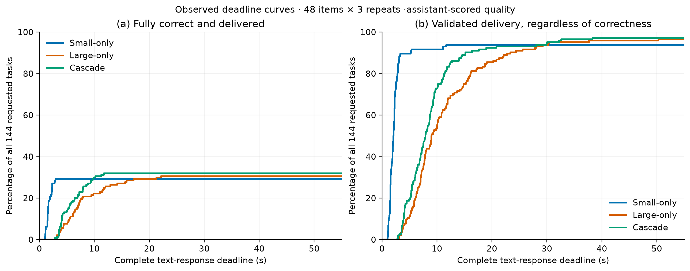
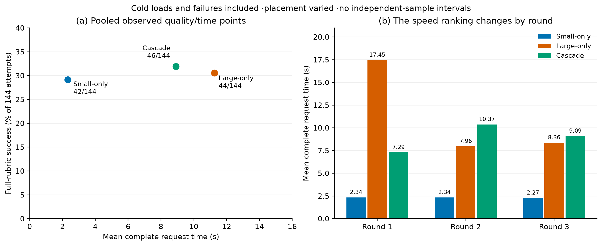

# Final quality, latency and cost analysis

This is a post-collection analysis of Step 3's 432 attempts, not another model experiment. It adds figures, descriptive deadline readouts and measured cost summaries without changing any answer or judgment. Step 4 was not named in the saved plan; this final-analysis scope was stated as the working interpretation while clarification was requested.

Quality is full-rubric success including appropriate abstention when called for, assessed by blinded assistant reviewers. Human validation remains pending. Each arm repeats the same 48 requests three times; repetitions and shared scenarios are dependent. No confidence interval, significance claim, noninferiority margin, quality floor or acceptance deadline is inferred.

## Overall observed tradeoff

| System | Success / attempts | Mean / median / p95, s | Validated |
| --- | --- | --- | --- |
| Small-only | 42/144 (29.2%) | 2.314 / 2.090 / 3.270 | 135/144 |
| Large-only | 44/144 (30.6%) | 11.255 / 8.955 / 25.430 | 139/144 |
| Cascade | 46/144 (31.9%) | 8.916 / 7.749 / 18.772 | 140/144 |

All-attempt timing includes cold loads and failures. A fast invalid response earns no success credit. This measures the complete text pipeline, not spoken latency. The larger system's memory classifier can change supplied evidence, so these are not matched-evidence generator-capability measurements.

## Correct answers delivered by a deadline

The complete empirical curves are primary. The 5, 10, 15 and 30-second rows below are post-hoc reading coordinates, not chosen application requirements or success thresholds. Every denominator includes all 144 requested tasks, including failures.

| Deadline | Small-only | Large-only | Cascade |
| --- | --- | --- | --- |
| 5 s | 42/144 | 11/144 | 20/144 |
| 10 s | 42/144 | 32/144 | 43/144 |
| 15 s | 42/144 | 39/144 | 46/144 |
| 30 s | 42/144 | 44/144 | 46/144 |

The left panel counts only fully correct delivered answers. The right panel counts every validated delivery, including semantically wrong answers. These are different outcomes; neither uses only successful requests as its denominator. Curves are right-continuous and use complete request time.

## Repetition and complementary outcomes

| System | Round | Success / 48 | Mean time, s |
| --- | --- | --- | --- |
| Small-only | 1 | 14 | 2.335 |
| Large-only | 1 | 13 | 17.448 |
| Cascade | 1 | 14 | 7.288 |
| Small-only | 2 | 14 | 2.336 |
| Large-only | 2 | 15 | 7.957 |
| Cascade | 2 | 16 | 10.372 |
| Small-only | 3 | 14 | 2.271 |
| Large-only | 3 | 16 | 8.359 |
| Cascade | 3 | 16 | 9.087 |

The pooled cascade mean is 20.8% below large-only, but large-only is faster in rounds 2 and 3. Large-only round 1 had much less reported GPU allocation (61.5%) than the first cascade session's large model (83.6–86.2%). This makes causal attribution to routing inappropriate. Only 3/144 cascade generations used small; 141 used large. The observed aggregate points are not an optimized or statistically established Pareto frontier.

Large-only alone succeeds on 4, 6 and 7 cases that small-only misses in the respective rounds; small-only alone succeeds on 5 cases in each round. The deployed cascade still misses small-only wins. These paired results describe complementary complete-system behavior, not a deployable oracle or a measured latency for a different routing policy. The exact patterns are in summary.json.

## Measured cost and additional complexity

| System | Whole sampled energy, kJ | J / attempted task | Total J / full success | Backend loading, s | Actual small / large generators |
| --- | --- | --- | --- | --- | --- |
| Small-only | 4.662 | 32.4 | 111.0 | 28.363 | 144 / 0 |
| Large-only | 16.736 | 116.2 | 380.4 | 72.821 | 0 / 144 |
| Cascade | 14.291 | 99.2 | 310.7 | 166.549 | 3 / 141 |

Energy integrates sampled whole-device VDD_IN, including setup, cleanup and background work, without idle subtraction. Scheduler waits are excluded. Total joules divided by full successes allocates the cost of every failed or wrong attempt too; it is not energy measured only on correct requests. Loading is already included in latency/energy and must not be added again. Separate request-window energy and its sampling coverage are saved in summary.json. These results do not isolate model energy or predict another session order.

| System | Peak whole-device RAM, MiB | Peak logical swap, MiB |
| --- | --- | --- |
| Small-only | 5707 | 1648 |
| Large-only | 6530 | 1642 |
| Cascade | 6521 | 1666 |

These are session maxima with background activity, not isolated model footprints. Existing zram occupancy is logical usage of compressed pages in physical RAM, not additional RAM or a measure of active swapping. CPU and GPU allocations share physical memory on this Jetson.

## Supported conclusion and remaining evidence

This pilot does not establish a useful adaptive-selection advantage. Cascade adds two successes over large-only and four over small-only across 144 dependent attempts, while taking 3.85 times the small-only mean request time and incurring greater loading cost than either fixed arm. The general-task gains coexist with personal-recall regressions, and every system scores 0/36 on full temporal/synthesis rubrics. Neither a requirement-level feasible winner nor quality equivalence has been established.

New independent scenarios and human grading, matched-evidence generator controls, stable-placement replication, retrieval-policy ablations, live changing-memory episodes and microphone-to-speaker tests remain separate work. Existing ARC results are not pooled into this application pilot. No runtime, memory database, swap configuration or model residency was changed for this analysis.

Figures are provided as PNG previews and vector PDF/SVG. CSV files contain the plotted curves, deadline readouts and per-round values. Input hashes, analysis source and plotting package versions are preserved in provenance.json and the archived script.
